  

  

 

## About Me:

- I am a Cloud Engineer working with AWS cloud infrastructure and architecture.
- I enjoy designing clean, secure, and scalable cloud systems for real-world operations.
- My focus is on reliability, automation, cost optimization, and practical cloud architecture.
- I like turning business requirements into simple cloud solutions that are easy to operate and ready to grow.

 

  

 

  
  
  

 

  

