  

  

 

## About Me:

- ☁️ Cloud Engineer working with AWS cloud infrastructure and architecture.
- 🧭 Architecture-focused mindset for clean, secure, and scalable cloud systems.
- 🛡️ Focused on reliability, automation, cost optimization, and practical operations.
- 🌱 Turning business requirements into simple cloud solutions that are easy to operate and ready to grow.

 

  

 

  

